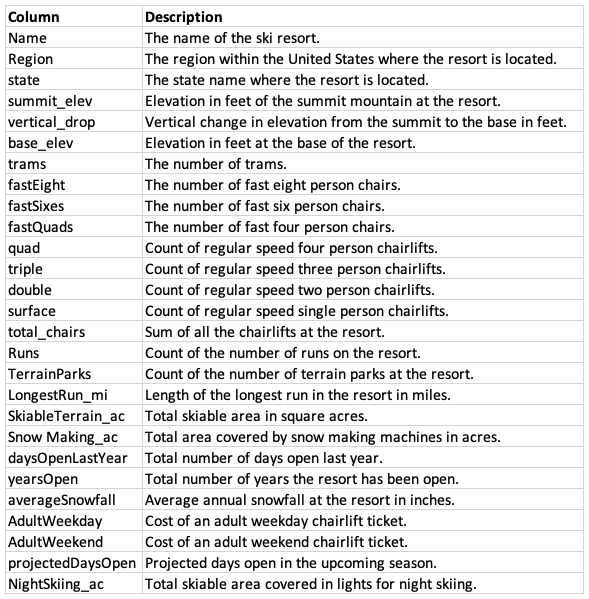
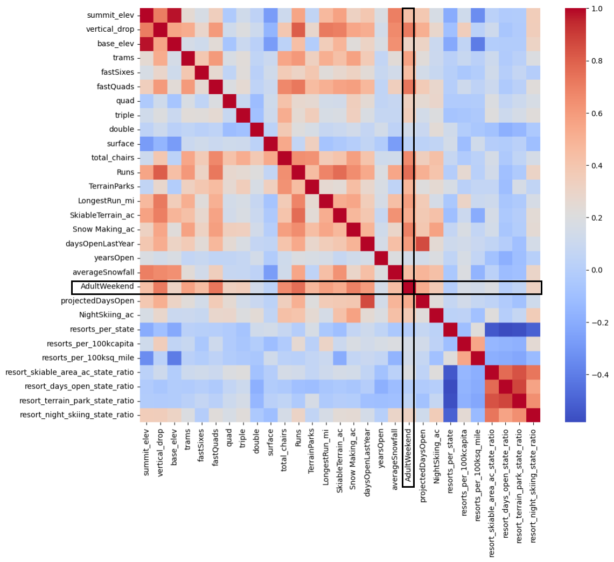
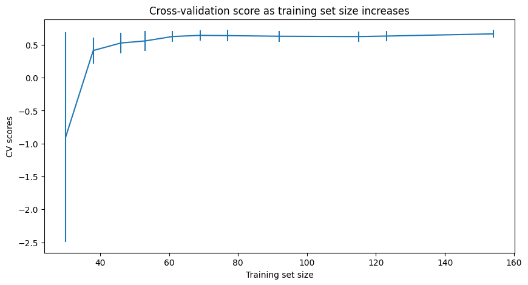
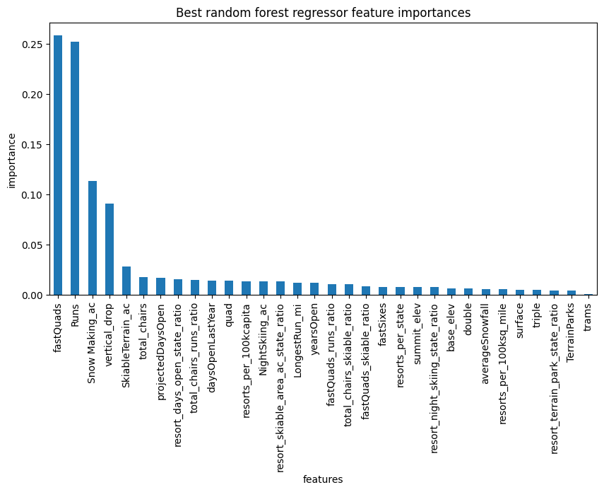

# Big Mountain Resort Pricing Strategy (2025)
**Author:** Georgia Jenkins 
**Date:** March 28, 2025

## Background
Compared with ski resorts around the United States, Big Mountain Resort ranks among the top competitors when it comes to providing customers with high-value facilities. In a given season, 350,000 skiiers and snowboarders visit Big Mountain Resort to enjoy the 2,353 ft vertical drop, 3,000 acres of skiiable terrain, and 105 runs, the longest of which is 3.3 miles. With 14 total chairs, 3 fast quads, and 600 acres of snow making capacity, Big Mountain customers can rest easy knowing their ticket guarantees a fruitful visit. 

However, Big Mountain Resort is not capitalizing on these facilities as much as it could. The current pricing strategy charges a premium above the average price of resorts in the market. This approach neglects to consider which facilities are most valuable to customers. This report outlines a data-driven business strategy that will more than cover increased operating costs from the newest chair lift ($1,540,000) and set ticket prices appropriately for the upcoming season. 

## Methods
### Data Wrangling
Big Mountain Resort Database Manager, Alesha Eisen, provided a CSV file dataset with data on 330 resorts across 27 variables (Figure 1). The dataset contained no duplicates, and Big Mountain Resort was present. 

 
*Figure 1*

The fastEight column was removed because is was missing >50% of records, and of the non-null values, all but 1 were equal to 0. One outlier value was corrected for a resort listing >26,000 acres of skiiable terrain. 14% of resorts had no price data under AdultWeekend or AdultWeekday. These resorts were removed. There was minimal difference between AdultWeekday and AdultWeekend pricing. However, AdultWeekend had fewer missing values, so this variable was chosen as the target feature for this analysis. The AdultWeekday variable was removed. After cleaning, 277 rows of ski resort data remained. An aggregated state summary was also created and combined with population data from each state. 

### Exploratory Data Analysis (EDA)
Big Mountain Resort's home state of Montana is in the top 5 states for total area, skiiable area, and resorts per 100k capita, but not in the top 5 states for population, resorts per state, night skiing area, or days open per year. After running a principal components analysis, we concluded that there isn't a clear relationship between state and ticket price, though resort density per capita and per area are important. 
After combining state summary data with the cleaned resort dataset, 4 ratio variables were calculated:
* ratio of resort skiable area to total state skiable area
* ratio of resort days open to total state days open
* ratio of resort terrain park count to total state terrain park count
* ratio of resort night skiing area to total state night skiing area

Of these, the ratio of night skiing area to total state night skiing area is correlated with AdultWeekend ticket price. Other variables correlated with pricing include vertical_drop, fastQuads, Runs, total_chairs, and Snow_Making_ac (Figure 2).

 
*Figure 2*

### Modeling
**Preprocessing and Training**
First, we removed Big Mountain Resort from the training dataset to avoid biasing the model. Then we subsetted the dataset using a 70/30 train/test split on the feature data and the target metric (AdultWeekend ticket price). To set a baseline idea of performance, we calculated the mean of the dependent variable as $63.81 with a mean absolute error of $19.14. 

**Model 1: Linear Regression**
The initial model used a linear regression. We used standard scaling and imputed the missing values with the median and mean and found little difference in the result. The mean absolute error of this model was about $9 whether we imputed with the median or the mean. In refining the linear model, we found 8 to be the best value for k. Vertical drop was the biggest positive feature in the model, followed by snow making acreage.

**Model 2: Random Forest**
Next, we built a random forest model with 5-fold cross validation. We found that imputing with the median is helpful, but scaling the data is not. The most important features in the random forest are shown in Figure 3. The top 4 most important features were shared with the linear model (fastQuads, Runs, Snow_Making_ac, and vertical_drop).

 
*Figure 3*

## Results
### Model Recommendation: Random Forest

We compared the linear model with the random forest model. The random forest model had a lower cross-validation mean absolute error by almost $1 and had less variability. Verifying performance on the test set produced performance consistent with the cross-validation results. We recommend proceeding with the following data pipeline for this model: 
1. Simple imputing with the median
2. No scaling 
3. Random forest regressor model 

The model does not require more data to be collected, as benefits of a larger training set peter off once the training set hits a sample size of 40-50 (Figure 4). 

 
*Figure 4*

### Pricing and Strategy Recommendations
Big Mountain Resortcurrently charges $81 for an adult weekend ticket. Given the features offered by Big Mountain, the modelled ticket price is $95.87. Even with the expected mean absolute error of $10.39, this suggests Big Mountain is undercharging. Big Mountain is among the top resorts when it comes to the most important features. 

Four strategies proposed by Big Mountain Resort were tested through the model:
1. Permanently closing down up to 10 of the least used runs. This doesn't impact any other resort statistics.
2. Increase the vertical drop by adding a run to a point 150 feet lower down but requiring the installation of an additional chair lift to bring skiers back up, without additional snow making coverage
3. Same as number 2, but adding 2 acres of snow making cover
4. Increase the longest run by 0.2 mile to boast 3.5 miles length, requiring an additional snow making coverage of 4 acres

Big Mountain recently installed a chair lift, which increases operating costs by $1,540,000. Given an expected 350,000 visitors staying an average of 5 days this season, Big Mountain Resort could support increasing the price of the ticket by $1.99 and earning an additional $3,474,638 this season by employing Scenario 2, which involves adding a run, increasing the vertical drop by 150 feet, and installing an additional chair lift. 

Other proposed scenarios are not predicted to have a positive impact on revenue. Closing up to 10 runs is predicted to drive ticket prices down. The other two scenarios, which involve increasing snow making area by 2-4 acres and increasing the longest run by 0.2 miles have no predicted effect, though they would most likely increase operating costs, which would result in a decrease in net revenue.

## Conclusion
Some additional information could strengthen this analysis. For example in our recommended scenario, we know the cost of adding an additional chair lift, but we do not know the cost of adding a run or increasing the vertical drop by 150 feet. 

The modelled price for Big Mountain was higher than the current price because of Big Mountain's status as a top resort for providing the facilities that matter most. However, the current price already sets Big Mountain as the most expensive resort in Montana. Thus, the modelled price of $95.87 may come as a surprise. However, increasing the price by just $1.99 would be enough to comfortably cover the cost of the new chair lift. Big Moutain leadership may want to  consider increasing ticket prices by $1.99 before taking the leap from $81 to $95.47, as such a large increase in one season has the potential to shock customers.

This model will be added to a shared GitHub repository for future business analysts to use and explore. For future projects, it may be useful to create a simple dashboard that allows Big Mountain leadership to test scenarios at will. 

## Acknowledgements
Thank you to Jimmy Blackburn, Director of Operations and Alesha Eisen, Database Manager from the Big Mountain Resort Team for your contributions to this analysis. 

